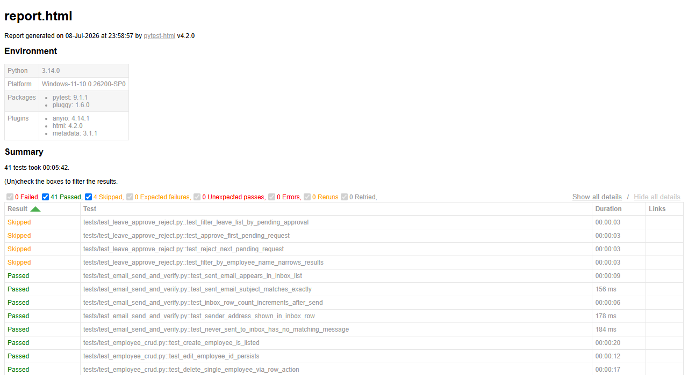
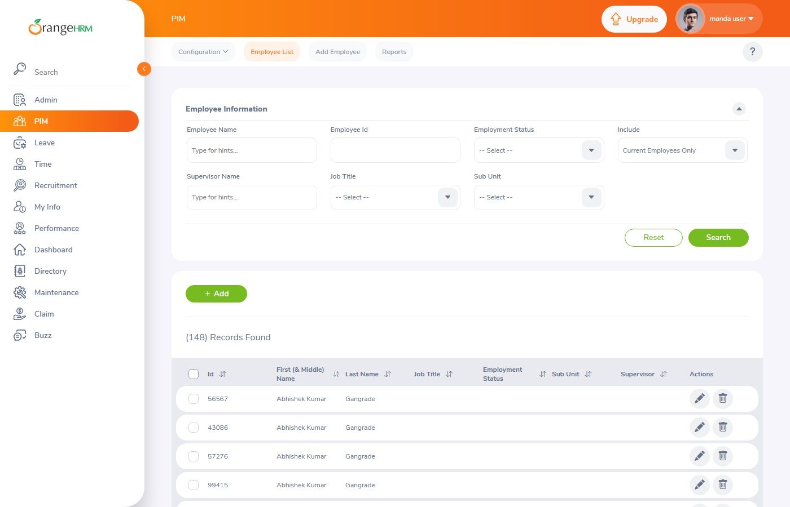
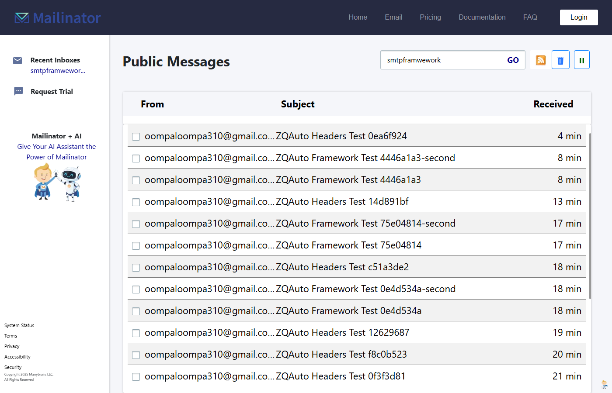

# Playwright (Python) + pytest Test Automation Framework

A Page-Object-Model test suite built with Playwright's sync API and pytest. It covers
search, filtering, bulk actions, approve/reject workflows, CRUD, and detail-view
validation against two public targets, plus a send-and-verify email flow built on real SMTP and a public inbox.

## What this tests, and why these two targets

| Target | What's exercised |
|---|---|
| [OrangeHRM open-source demo](https://opensource-demo.orangehrmlive.com/) | Login, Admin > User Management (search/filter/bulk delete), PIM > Employee List (search/filter/CRUD/detail view), Leave (assign/approve/reject) |
| [Mailinator](https://www.mailinator.com/) public inbox | Send a real email via SMTP, verify it lands in a public inbox, open it and check the message detail/raw headers |

OrangeHRM is a common practice target — plenty of tutorials automate its login form,
and that's fine. This project isn't trying to prove the app is testable; it obviously
is. The point is to show a consistent set of engineering decisions applied across a real, moderately complex app:

- Page objects only hold locators and interaction methods — no assertions live there.
  Every `expect(...)` and every multi-step workflow ("assign leave → filter → approve →
  verify status") lives in the test files instead. See [Architecture](#architecture).
- Test data is created and cleaned up per scenario (throwaway users/employees with
  randomized suffixes) rather than relying on fixed seed data, because this demo is
  public and shared with everyone else automating against it at the same time.
- The suite is honest about running in a shared, uncontrolled environment: a few
  scenarios in `test_leave_approve_reject.py` skip (rather than fail) when the demo
  currently has no pending leave requests from other users. More on that in
  [Known limitations](#known-limitations-of-a-shared-public-demo).
- There's a CI story behind it: this suite is meant to run from the Jenkins pipeline
  already in this repo ([`Jenkinsfile`](Jenkinsfile)), re-triggered on a schedule so it
  keeps checking the app's health rather than only running when someone remembers to.

The differentiator is the framework design and the CI loop around it, not the
application under test.

## Architecture

```
Playwright/
├── conftest.py            # logger, browser, orangehrm_login, pages, mailinator_page fixtures
├── pageObjects/            # locators + interactions only
│   ├── login_page.py
│   ├── user_management_page.py
│   ├── employee_list_page.py
│   ├── leave_list_page.py
│   ├── inbox_page.py
│   └── message_detail_page.py
├── utils/                   # pure functions, no Playwright assertions
│   ├── helpers.py           # retry_action, unique_suffix, set_date_field, debug_pause
│   ├── locators.py          # Inputs (timeouts) + one selector class per page, all XPath
│   ├── email_sender.py       # send_test_email() via smtplib
│   └── regex_patterns.py    # Patterns - header/email regexes for test-file parsing
└── tests/                    # assertions, waits-with-expect, and workflows live here
```

Page objects stick to `goto`, `click_*`, `fill_*`, `select_*`, and `get_*` methods —
nothing that asserts anything. That keeps the test files as the single place to read
to understand what a scenario actually checks, and keeps the page objects reusable
across different assertions without carrying opinions about what "correct" looks like.

Login happens once per test file: a module-scoped `orangehrm_login` fixture in
`conftest.py` logs in once and hands the authenticated page to every test in that file
through the `pages` fixture. Not once per test (too slow), not once for the whole
suite (couples every file's data to every other file's).

`page.pause()` is there when you need it, wrapped as `utils.helpers.debug_pause(page)` —
but it only actually pauses if `DEBUG_PAUSE=true` is set. Left on by default it would
hang forever waiting for someone to click Resume in the Inspector, which is exactly
what would happen to an unattended Jenkins cron run. Everything else waits properly
via `wait_for_selector` / `wait_for_function` / Playwright's auto-waiting `expect(...)`
rather than a fixed sleep.

## Architecture note: the email piece

```
utils/email_sender.py  --SMTP-->  Gmail  --relay-->  Mailinator public inbox
                                                            │
                                                  pageObjects/inbox_page.py
                                                  (Playwright verifies the
                                                   message appears in the list)
                                                            │
                                                  pageObjects/message_detail_page.py
                                                  (Playwright opens it and reads
                                                   the raw source / headers)
```

`send_test_email()` sends a real email over SMTP (Gmail, using an App Password — your
regular login password will not work, Gmail rejects that for SMTP outright) to
`<inbox>@mailinator.com`. Mailinator's public inboxes need no account or signup at
all: anyone can send to any address at that domain, and anyone who knows the inbox
name can view it at `https://www.mailinator.com/v4/public/inboxes.jsp?to=<inbox>`.

SMTP accepting the message only means Gmail queued it for relay — it doesn't mean the
message has reached Mailinator yet. Delivery can take anywhere from a couple of
seconds to under a minute. `InboxPage.wait_for_message(subject)` polls the live,
auto-updating inbox list for that specific subject instead of assuming it's already
there, which is what keeps the two email test files reliable instead of racy.

## How to run locally

```bash
python -m venv .venv
source .venv/bin/activate        # or .venv\Scripts\activate on Windows
pip install -r requirements.txt
python -m playwright install chromium

cp .env.example .env             # then fill in the values below
pytest
```

`.env` values:

| Variable | Purpose |
|---|---|
| `ORANGEHRM_URL` / `ORANGEHRM_USER` / `ORANGEHRM_PASS` | defaults already point at the public demo (`Admin` / `admin123`) |
| `SMTP_USER` | a Gmail address to send test emails from |
| `SMTP_APP_PASSWORD` | a 16-character App Password for that account ([myaccount.google.com/apppasswords](https://myaccount.google.com/apppasswords), needs 2-Step Verification turned on first) — your regular password will not work |
| `MAIL_DOMAIN` | defaults to `mailinator.com` |
| `MAILINATOR_INBOX` | any inbox name you want to use as the destination |
| `HEADLESS` | `true` (default) or `false` to watch the browser locally |
| `DEBUG_PAUSE` | `true` to enable real `page.pause()` breakpoints; leave unset/`false` otherwise |

Running a single file or scenario works as usual:

```bash
pytest tests/test_employee_crud.py -v
pytest tests/test_login.py::test_valid_login_reaches_dashboard -v
```

A self-contained HTML report is written to `report.html` after every run
(`pytest.ini` sets `--html=report.html --self-contained-html`), and failure
screenshots land in `screenshots/` (both gitignored).

## Continuous monitoring: Jenkins + Prometheus + Grafana

The `Jenkinsfile` in this repo isn't just for one-off CI runs — it's wired up to re-run
the whole suite every 2 hours via a cron trigger, with the results flowing into a small
monitoring stack so you can see health trends over time instead of just the latest
build.

```
Jenkins (cron every 2h, runs pytest)
   │  exposes build/test metrics at /prometheus (Jenkins Prometheus plugin)
   ▼
Prometheus (scrapes Jenkins every 30s)
   ▼
Grafana (dashboard: pass/fail counts, build duration, health score, result history)
```

Everything lives under `monitoring/`: a `docker-compose.yml` running all three
services, a custom Jenkins image (`monitoring/jenkins/Dockerfile`) with Python and
Playwright's Chromium dependencies pre-installed so builds don't need a nested Docker
agent, and Grafana provisioning files so the Prometheus datasource is wired up
automatically on first boot. It's deliberately sized for a small instance — a t3/t2.micro
with a 4GB swap file handles all three containers plus a full Playwright test run,
just slowly.

This runs on its own EC2 instance, separate from wherever you run the test suite
locally. Screenshots of the Grafana dashboard live in `monitoring/screenshots/`,
including one from a build where a test was deliberately broken to confirm failures
actually show up (health score drops, the result panel turns red) rather than
silently vanishing, and one ([`dashboard_40h_history.png`](monitoring/screenshots/dashboard_40h_history.png))
covering 22 real cron builds accumulated over 40 unattended hours ([`jenkins_build_history.png`](monitoring/screenshots/jenkins_build_history.png)
shows the same run list on the Jenkins side).

That 40-hour window is worth being honest about: only 6 of the 22 builds came back
fully green. The rest weren't a regression in the suite — they're what actually
happens when you point real browsers at a shared public demo and send real email
through a real inbox, unattended, every 2 hours for two days straight. The clearest
pattern is `test_message_detail_and_headers.py` failing all 5 of its tests together
in about a third of the runs, which lines up with Gmail/Mailinator delivery lag
under repeated automated sending rather than anything in the test code. A few other
failures track ordinary shared-demo slowness (locator timeouts on a congested
instance) or state built up by 22 runs' worth of other automation. None of this was
smoothed over — it's exactly why the dashboard exists.

To make failures like these actually debuggable from Jenkins instead of just visible
as a red build, the failure-screenshot hook in `conftest.py` captures on both fixture
*setup* failures (e.g. a login timeout) and test *call* failures, and
`archiveArtifacts` in the `Jenkinsfile` picks up everything under `screenshots/**`
and `test-results/**` alongside the HTML report on every build, pass or fail.

## Known limitations of a shared public demo

OrangeHRM's demo is public, and everyone automating against it is changing its data at
the same time. A few things that looked like bugs during development turned out to be
real application behavior worth writing down:

- Leave assigned through "Assign Leave" (an admin granting leave on someone's behalf)
  is saved straight into `Scheduled` status — it never needs approval, so it never
  shows up in the Pending Approval view. Only self-service "Apply Leave" requests do,
  and the same account that applied can't approve or reject its own request. So the
  approve/reject/filter scenarios in `test_leave_approve_reject.py` act on whatever
  ambient Pending Approval requests other users' automation has left in the shared
  list, and skip — rather than fail — on the rare occasion none currently exist. That's
  real shared-environment state, not a defect in this suite.
- Several search/autocomplete fields only match employees who don't already have a
  linked resource — Admin's "Add User" employee picker, for instance, only offers
  employees without an existing account. Tests use broad, resilient queries (a single
  common letter) instead of one fixed name, because a fixed name can get fully used up
  by repeated runs, this suite's own or anyone else's.
- The shared demo can respond slowly when a lot of people are automating against it at
  once. Timeouts throughout this suite are generous on purpose, to absorb that instead
  of masking a real problem.

## Screenshots of a passing run

Self-contained pytest-html report (0 failed, 41 passed, 4 skipped):



OrangeHRM PIM > Employee List, mid-suite:



Mailinator public inbox showing delivered test emails:


